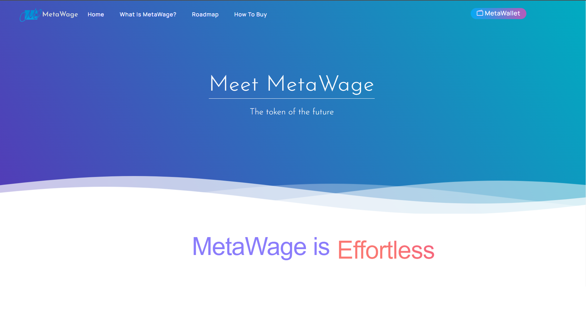
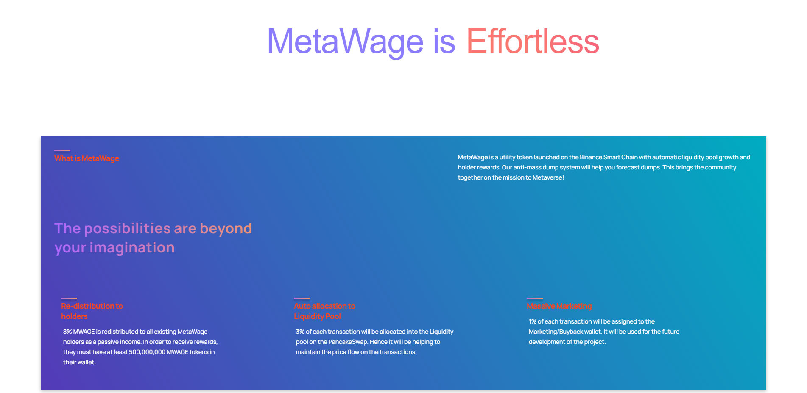
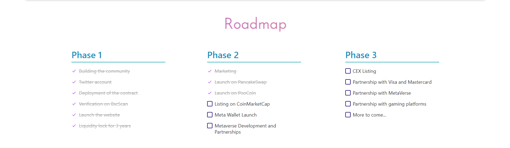
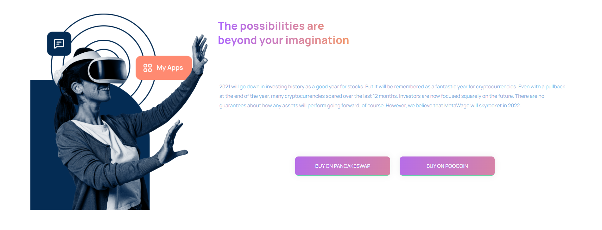
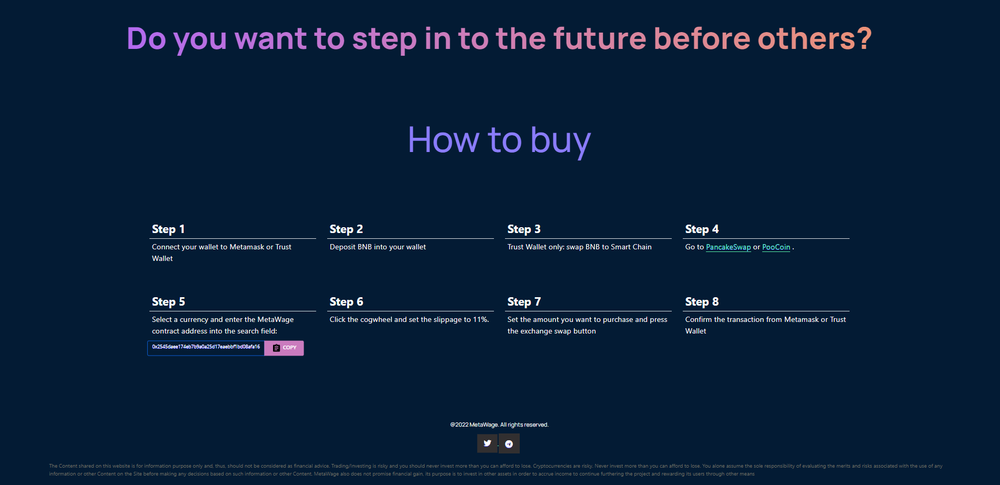

# MetaWage
## Introduction
MetaWage is a presentation website for a new crypto-token.

##Technologies used:
Javascript, HTML, CSS, React

##Features

- React Functional components and their reusability
- React file and folder structure
- Fundamental CSS properties to master flex & grid
- Fundamentals of the CSS BEM Model
- From soft and pleasant animations to complex gradients
- Perfectly placed media queries for satisfactory responsiveness covering almost devices

##Preview

